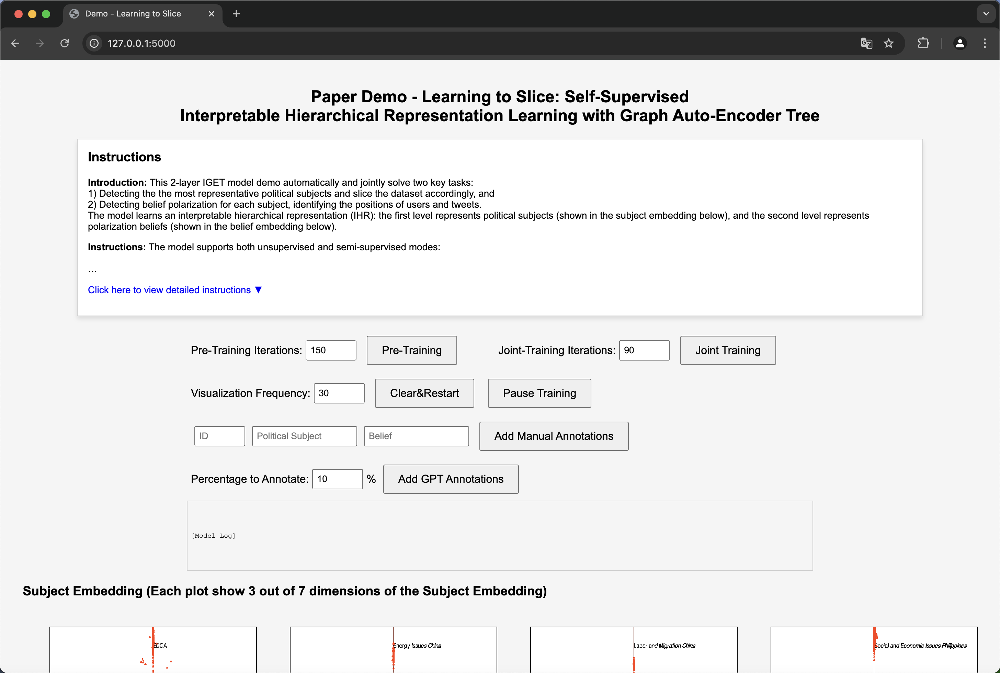
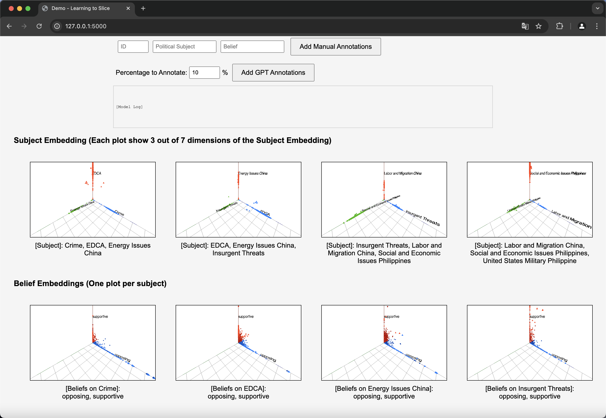
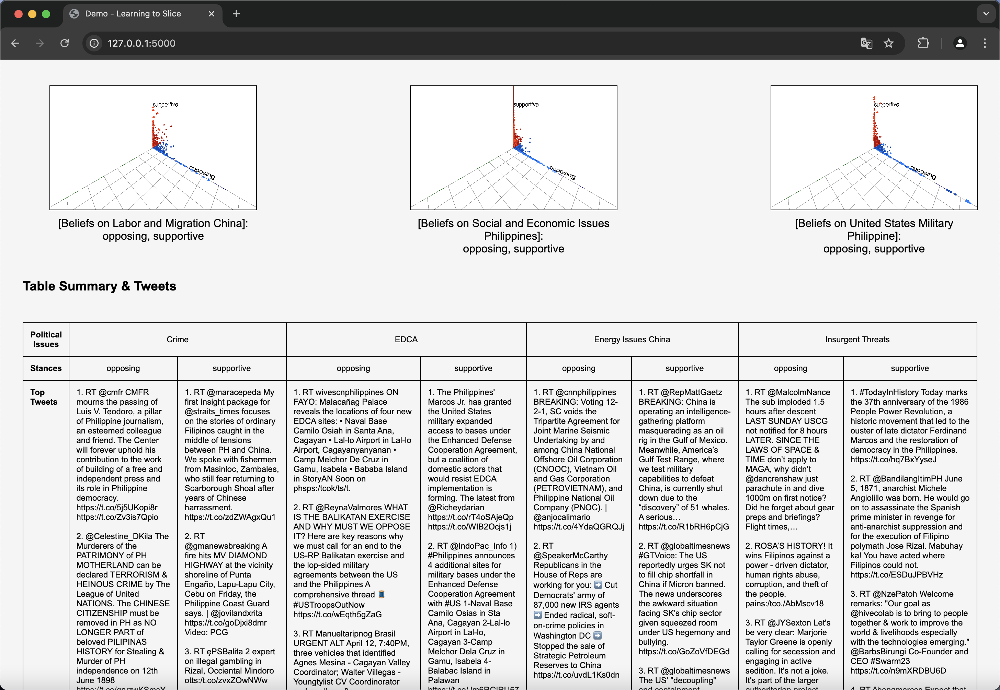
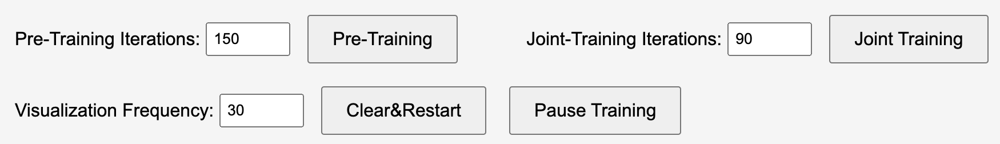
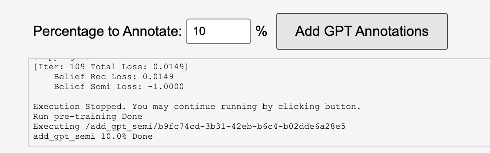
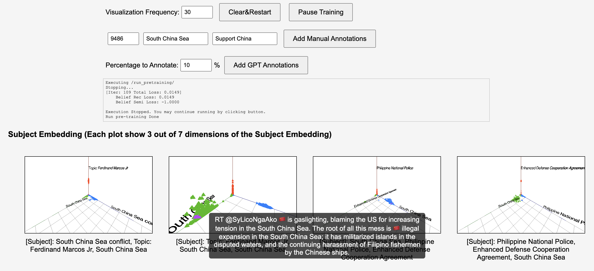

# Learning to Slice: Self-Supervised Interpretable Hierarchical Representation Learning with Graph Auto-Encoder Tree

This GitHub repository includes the **source code**, **datasets**, and **demo** for the proposed **IGAT** model.

## Data Preprocess
We support any dataset collected with Twitter (now X) official API, which is in the format of jsonl (see https://developer.x.com/en/docs/x-api). [`data_preprocess.py`](https://github.com/jinningli/IGAT/blob/main/data_preprocess.py) received a directory name containing one or more of such jsonl files and generate the dataframe required for IGAT model. It also supports filtering out inactive users and tweets by specifying the desired counts of them.

#### Usage

```bash
python data_preprocess.py \
    --input_dir ./raw_data \
    --output_dir ./processed_data \
    --max_txt_cnt 1000000 \
    --max_tweet 50000 \
    --max_user 10000
```
#### Arguments

| Argument         | Type   | Default   | Description                                                                 |
|------------------|--------|-----------|-----------------------------------------------------------------------------|
| `--input_dir`    | `str`  | —         | Path to the directory containing one or more `.jsonl` Twitter files.        |
| `--output_dir`   | `str`  | —         | Output directory where the processed files will be saved.                   |
| `--max_txt_cnt`  | `int`  | `1e9`     | Maximum number of text entries (tweets) to load. Useful for large corpora.  |
| `--max_tweet`    | `int`  | `50000`   | Maximum number of tweets to keep. Helps filter out inactive users.          |
| `--max_user`     | `int`  | `10000`   | Maximum number of users to retain.                                          |

## Hyper-Parameters
We list all the hyper-parameters for the experiments in paper as the following table:

| Parameter                | Parameter Meaning                                     | Philippines Dataset | Ukraine-Russia War Dataset | Election Dataset |
|--------------------------|-------------------------------------------------------|----------------------|-----------------------------|------------------|
| $\delta$                 | Maximum Tree Depth                                    | 4                    | 4                           | 4                |
| $d$                      | Maximum Branching Factor                              | 7                    | 5                           | 2                |
| $\eta$                   | Belief Embedding Dimensionality (leaf model)          | 2                    | 2                           | 2                |
| Learning Rate            | Learning Rate                                         | 0.1                  | 0.1                         | 0.1              |
| Warm-Up Iteration        | Number of iterations for pre-training node split      | 300                  | 300                         | 300              |
| Joint Training Iteration | Number of iterations for joint training               | 600                  | 600                         | 600              |
| Temperature              | Sharpness of assignment vector for node split         | 0.1                  | 0.1                         | 0.1              |

## Environments

### Devices
The model can run on both `CPU` and `GPU`. The minimum memory requirement is **24 GB** for either system RAM or GPU memory. We recommend using a **GPU** for training, as training on a CPU is significantly slower.

### Python Libraries
##### Required Packages for Model Training:
```
torch                    2.6.0+cu118
matplotlib               3.10.0
numpy                    2.1.2
pandas                   2.2.3
seaborn                  0.13.2
scikit-learn             1.6.1
scipy                    1.15.1
```
##### Required Packages for Demo:
```
Flask                    3.1.0
openai                   1.61.1
gunicorn                 23.0.0
```

## Model Training and Inference
We provide **three datasets** for testing: `Philippines`, `Election`, and `Ukraine-Russia War`, available in `./datasets`. The datasets will be further refined to comply with ethical and privacy policies before formal publication.

### Training and Inference Commands
#### Train and Inference on the Philippines Dataset:
```
python3 main.py --exp_name philippine_test --data_path datasets/philippine_mix.csv --device 1 --seed 0 --belief_dim 7 --polar_dim 2 --semi_ratio 0.1
```
#### Train and Inference on the Election Dataset:
```
python3 main.py --exp_name election_test --data_path datasets/US_election_dataset.csv --device 1 --seed 0 --belief_dim 2 --polar_dim 2 --semi_ratio 0.1
```
#### Train and Inference on the Ukraine-Russia War Dataset:
```
python3 main.py --exp_name ukraine_test --data_path datasets/ukraine_war.csv --device 1 --seed 0 --belief_dim 5 --polar_dim 2 --semi_ratio 0.1
```

## Demo
### Launching the Demo
The demo optionally utilizes **GPT-3.5** to interpret the representation dimensions in a fully unsupervised mode. Before running the script, export your OpenAI API key:
```
export OPENAI_API_KEY="your-api-key-here"
```
#### Launch the Demo Backend Locally:
```
cd ./demo
python3 backend.py
```
#### Deploy the Demo Backend Externally (e.g., Port `15123`):
```
cd ./demo
gunicorn --workers 1 --threads 3 --bind 0.0.0.0:15123 backend:app
```
It supports automatic load balancing across multiple GPU devices for user requests.

### Instructions for Using the Demo
Once the demo is running (e.g., on `127.0.0.0:5000`), open your browser and go to `127.0.0.0:5000`.



#### 3D Visualizations
- **Subject Embeddings**: Represents learned slices detected by the IGAT model's internal nodes.
- **Belief Embeddings**: Captures beliefs from IGAT’s leaf nodes for each detected subject.
- **Visualization**:
  - Zoom and drag to adjust the view.
  - Hover over points to inspect tweet or user details.



#### Interpretation Table
The demo presents a table of top tweets categorized by **learned Interpretable Hierarchical Representation (IHR) dimensions**, organized by **beliefs** and **subjects**.



#### Training Options
- **Pre-Training**: Trains the slicing mechanism independently as warm-up iterations.
- **Joint Training**: Trains both the slicing mechanism and belief embeddings simultaneously.



### Semi-Supervision
#### **GPT-Based Annotation**
The demo supports automatic annotation using **GPT-3.5**. Click the `Add GPT Annotations` button.



#### **Interactive Annotation**
- The demo supports manual annotation in **semi-supervision mode**.
- Click a node in the visualization to label it and observe the embedding changes interactively.


